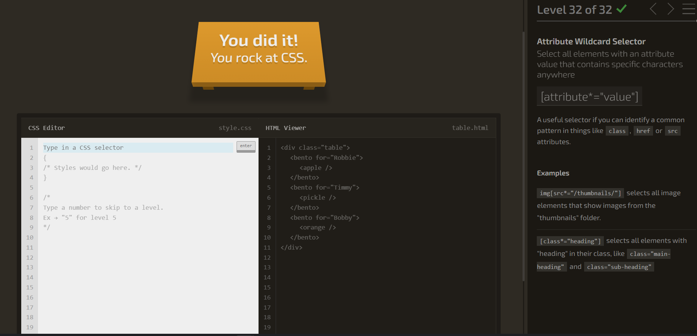

## TIPOS

## Selector de elemeto específico.

css
p {
  color: green; /* Aplica a todos los 
 */
}

## Selector de clase (.clase)

css
.highlight {
  color: red; /* Elementos con clase "highlight" */
}

## Selector universal (*)

css
* {
  margin: 0/10/50; /* Aplica a todos los elementos */
}

## Selector de ID (#id)

css
#header {
  font-size: 50px; /* Elemento con id "header" */
}

## Selector de agrupación

css
h2, h3, p {
  margin: 0; /* Aplica a h2, h3 y p */
}