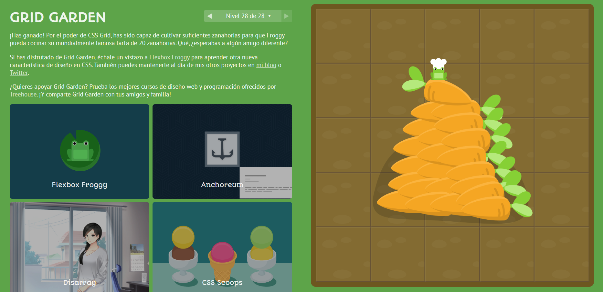

# Propiedades CSS vistas en Grid Garden

## Propiedades básicas para activar y definir el grid
`display: grid;` /* Activa el layout Grid en el contenedor */

## Definición de columnas y filas
`grid-template-columns;` /* Define el número y tamaño de las columnas */
`grid-template-rows;` /* Define el número y tamaño de las filas */
`grid-template-areas;` /* Define las áreas nombradas dentro del grid */

## Alineación y colocación de elementos
`grid-column;` /* Define el número de columnas en las que un elemento debe ocupar */
`grid-row;` /* Define el número de filas en las que un elemento debe ocupar */
`grid-gap;` /* Espacio entre filas y columnas (equivalente a gap) */
`grid-column-gap;` /* Espacio específico entre columnas */
`grid-row-gap;` /* Espacio específico entre filas */

## Alineación de contenido dentro de las celdas del grid
`justify-items;` /* Alineación horizontal de los elementos dentro de su celda */
`align-items;` /* Alineación vertical de los elementos dentro de su celda */
`justify-self;` /* Alineación horizontal de un solo elemento dentro de su celda */
`align-self;` /* Alineación vertical de un solo elemento dentro de su celda */

## Propiedades automáticas para el grid
`grid-auto-columns;` /* Define el tamaño de las columnas creadas automáticamente */
`grid-auto-rows;` /* Define el tamaño de las filas creadas automáticamente */
`grid-auto-flow;` /* Controla cómo se posicionan los elementos en el grid */

## Atajos para definir tanto columnas como filas
`grid-template;` /* Atajo para grid-template-columns y grid-template-rows */

## Propiedades específicas de la colocación de elementos
`grid-column-start;` /* Define el inicio de la columna en un elemento */
`grid-column-end;` /* Define el final de la columna en un elemento */
`grid-row-start;` /* Define el inicio de la fila en un elemento */
`grid-row-end;` /* Define el final de la fila en un elemento */
`grid-area;` /* Atajo para definir las posiciones de inicio y fin de fila y columna */

## Alineación de todo el contenido del grid
`justify-content;` /* Alineación del contenido del grid en el eje horizontal */
`align-content;` /* Alineación del contenido del grid en el eje vertical */

## Propiedades de alineación con atajos
`place-items;` /* Atajo para alinear tanto en el eje horizontal como vertical */
`place-self;` /* Atajo para alinear un solo elemento en ambos ejes */

## Propiedades adicionales
`grid-template-columns: repeat(3, 1fr);` /* Uso de repeat() para columnas repetidas */
`grid-template-rows: minmax(100px, auto);` /* Uso de minmax() para rangos de tamaños */
`auto-fill;` /* Usado con grid-template-columns para llenar automáticamente el espacio */
`auto-fit;` /* Similar a auto-fill, pero ajusta el espacio disponible de manera más flexible */
